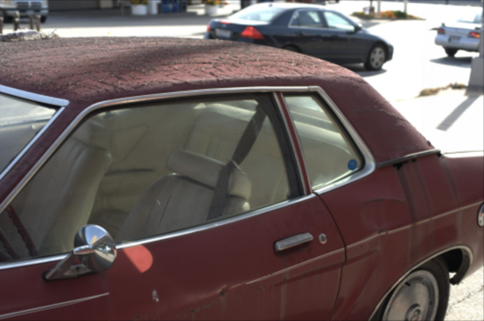
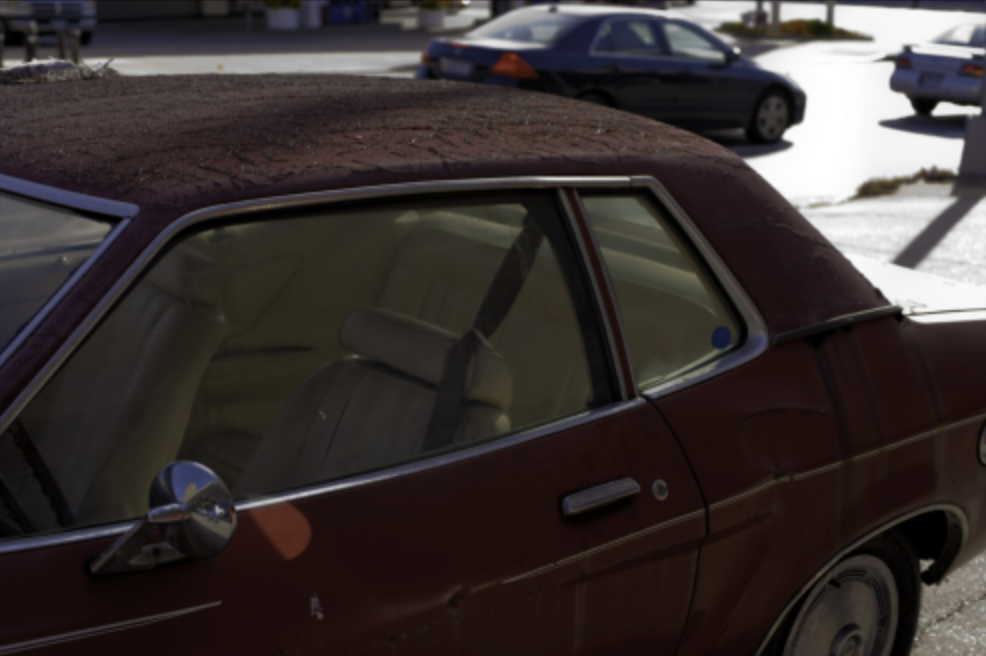
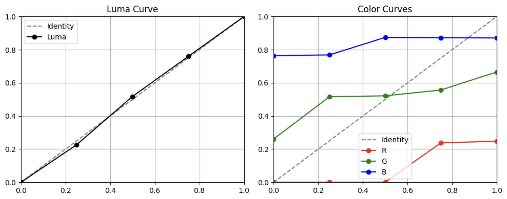
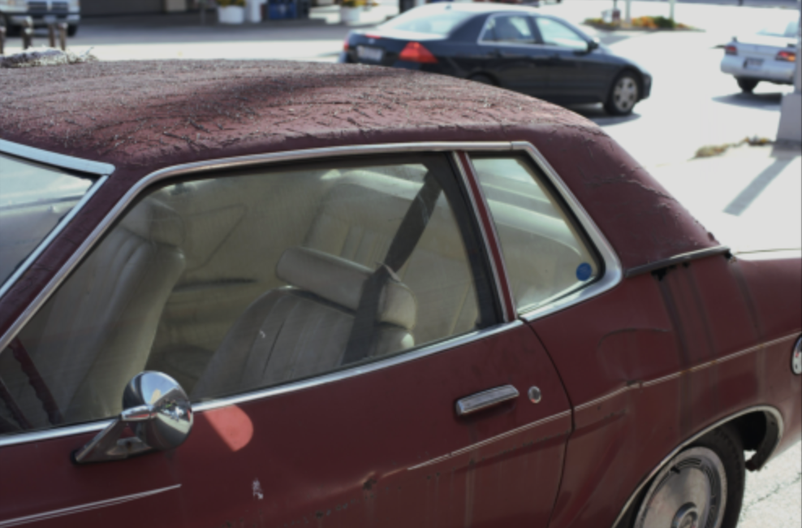
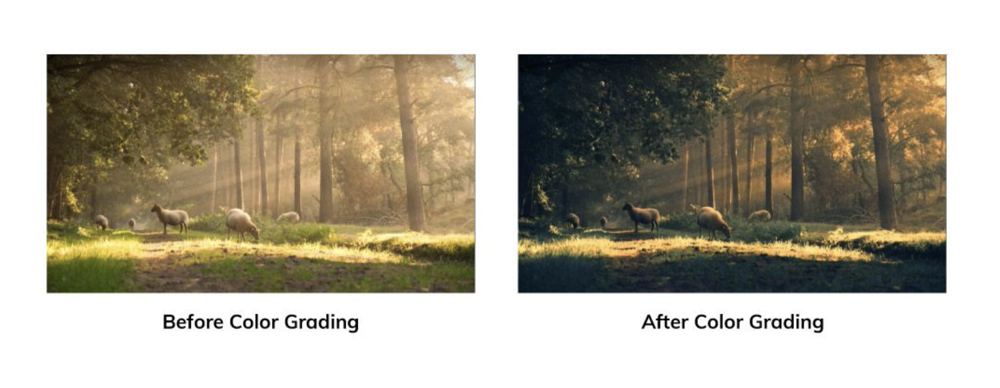
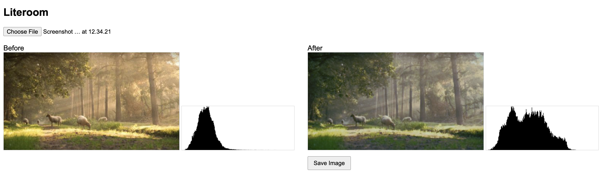
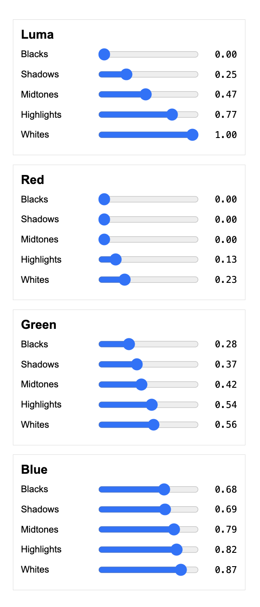

# Automated Photo Enhancement with Tone Curves

Dự án xây dựng hệ thống tự động chỉnh màu và ánh sáng ảnh bằng cách dự đoán các **tone curve toàn cục** (độ sáng và màu sắc) từ ảnh đầu vào.

---

## Phương pháp

- Sử dụng **EfficientNet-B0** để trích xuất đặc trưng thẩm mỹ từ ảnh  
- MLP dự đoán:
  - **Luma tone curve** (điều chỉnh độ sáng tổng thể)
  - **RGB tone curves** (điều chỉnh màu sắc)
- Các curve được áp dụng thông qua pipeline xử lý ảnh khả vi (*differentiable*) với LUT tuyến tính  

Mô hình được huấn luyện theo hướng **indirect supervision**: học dự đoán tham số chỉnh ảnh từ cặp ảnh gốc – ảnh đã chỉnh.

---

## Dữ liệu

- Dataset: **Adobe FiveK**
- Sử dụng các cặp ảnh RAW / retouched (C expert)
- Resize về `224×224` cho huấn luyện

---

## Kết quả

- Giảm lỗi trên tập validation:
  - **L1 Loss**: X.XXX  
  - **Perceptual Loss**: X.XXX  

Mô hình học được các điều chỉnh tự nhiên về:
- Exposure  
- Contrast  
- Color balance  

---

## Ví dụ minh hoạ

### Ảnh đầu vào

### Ảnh mục tiêu (Expert Retouch)

### Tone Curve được dự đoán

### Ảnh đầu ra của mô hình

---

## Demo Web

Trải nghiệm trực tiếp trên trình duyệt (TensorFlow.js): **Demo**

- Infer hoàn toàn client-side  
- Không cần server  

### Ảnh chuyên gia mong muốn (tham khảo Internet)

### Giao diện Web Demo

### Người dùng có thể tinh chỉnh thêm

---

## Tuỳ chỉnh sau khi dự đoán

Sau khi mô hình dự đoán, người dùng có thể chỉnh lại các tone curve:

- **Brightness (Luma)**
- **Red**
- **Green**
- **Blue**

---

## Hướng phát triển
- Mở rộng sang local tone mapping
- Export LUT 3D cho Lightroom / Photoshop
- Tối ưu model cho mobile
